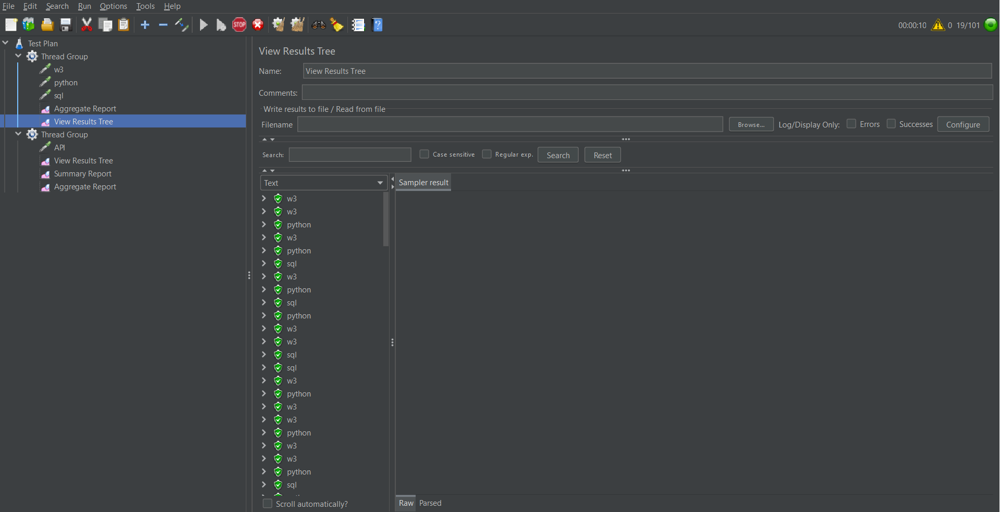

# JMeter

## Mục tiêu:

- Lựa chọn một trang web đơn giản: Ví dụ như trang web cá nhân hoặc trang web trường học.
- Sử dụng JMeter để tạo một kịch bản kiểm tra: Mô phỏng người dùng truy cập trang web.
- Chạy kịch bản kiểm tra và ghi lại kết quả.
- Phân tích kết quả kiểm tra: Bao gồm thời gian phản hồi, số lượng yêu cầu thành công, số lượng yêu cầu thất bại, v.v.
- Dựa trên kết quả phân tích, đưa ra kết luận về hiệu năng của trang web.

1. Kiểm tra hiệu năng web

# Kịch bản

Thread Group:

- Số lượng thread: 100
- Thời gian chạy: 60 giây
- Ramp-up period: 10 giây

HTTP Request:

- URL: https://www.w3schools.com/
- Method: GET
- Content encoding: UTF-8

Listeners:

- View Results Tree
- Aggregate Report

# Kết quả kiểm tra:

# Kết luận:

- Trang web https://www.w3schools.com/ có hiệu năng tốt. Số lượng yêu cầu thành công rất cao (100%), số lượng yêu cầu thất bại rất thấp (0,00%). Thời gian phản hồi trung bình, trung vị và percentil 90 đều ở mức thấp (dưới 100 ms). Chuyển tải của trang web cũng khá cao (12 yêu cầu/giây).

2. Kiểm tra hiệu năng API

## Mục tiêu:

- Sử dụng jMeter để tạo một kịch bản kiểm tra mô phỏng người dùng truy cập API thời tiết https://openweathermap.org/current.
- Chạy kịch bản kiểm tra và ghi lại kết quả.
- Phân tích kết quả kiểm tra, bao gồm thời gian phản hồi, số lượng yêu cầu thành công, số lượng yêu cầu thất bại, v.v.
- Dựa trên kết quả phân tích, đưa ra kết luận về hiệu năng của API.

## Kịch bản kiểm tra:

Thread Group:

- Số lượng thread: 100
- Thời gian chạy: 60 giây
- Ramp-up period: 10 giây

HTTP Request:

- URL: https://openweathermap.org/current
- Method: GET
- Content encoding: UTF-8

Listeners:

- View Results Tree
- Aggregate Report

## Kết quả kiểm tra:

## Kết luận:

Trang web https://openweathermap.org/current có hiệu năng tốt. Số lượng yêu cầu thành công trung bình (99,63%), số lượng yêu cầu thất bại thấp (0,37%). Thời gian phản hồi trung bình, trung vị đều ở mức thấp (dưới 100 ms). Chuyển tải của trang web trung bình(5 yêu cầu/giây).

## So Sánh :

Với 2 trang web https://www.w3schools.com/ và https://openweathermap.org/current thì trang web https://www.w3schools.com/ có hiệu năng tốt hơn khi có thể phản hồi số lượng request lớn hơn, tỉ lệ lỗi nhỏ hơn, thời gian phản hồi nhanh hơn
